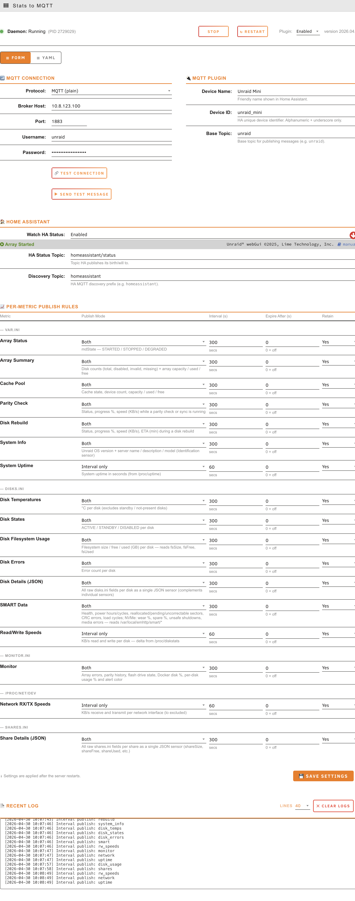

# unraid-stats2mqtt


An Unraid plugin (no Docker) that monitors your server and publishes metrics to an MQTT broker in **Home Assistant discovery format**.

## Features

| Metric | HA Entity | Values / Notes |
|---|---|---|
| Array status | `sensor.unraid_array_status` | `STARTED`, `STARTING`, `STOPPED`, `STOPPING`, `DEGRADED` |
| Array disk count | `sensor.unraid_array_num_disks` | count |
| Array disabled disks | `sensor.unraid_array_disabled_disks` | count |
| Array invalid disks | `sensor.unraid_array_invalid_disks` | count |
| Array missing disks | `sensor.unraid_array_missing_disks` | count |
| Array capacity | `sensor.unraid_array_capacity` | GB |
| Array used | `sensor.unraid_array_used` | GB |
| Cache state | `sensor.unraid_cache_state` | `ACTIVE`, `DEGRADED` |
| Cache devices | `sensor.unraid_cache_num_devices` | count |
| Cache capacity | `sensor.unraid_cache_capacity` | GB |
| Cache used | `sensor.unraid_cache_used` | GB |
| Parity status | `sensor.unraid_parity_status` | `IDLE`, `RUNNING` |
| Parity progress | `sensor.unraid_parity_progress` | `0`–`100` (%) |
| Parity speed | `sensor.unraid_parity_speed` | KB/s |
| Disk rebuild status | `sensor.unraid_rebuild_status` | `IDLE`, `RUNNING`, `PAUSED` |
| Disk rebuild progress | `sensor.unraid_rebuild_progress` | `0`–`100` (%) |
| Disk rebuild speed | `sensor.unraid_rebuild_speed` | KB/s |
| Disk rebuild ETA | `sensor.unraid_rebuild_eta` | minutes |
| Unraid version | `sensor.unraid_unraid_version` | version string |
| Update available | `binary_sensor.unraid_update_available` | `ON` / `OFF` — see [attributes](#sensor-attributes) |
| Server identification | `sensor.unraid_identification` | server name — see [attributes](#sensor-attributes) |
| System uptime | `sensor.unraid_system_uptime` | seconds |
| Disk temperature | `sensor.unraid_<disk>_temp` | °C |
| Disk state | `sensor.unraid_<disk>_state` | `ACTIVE`, `STANDBY`, `DISABLED` |
| Disk filesystem usage | `sensor.unraid_<disk>` | `0`–`100` (%) — see [attributes](#sensor-attributes) |
| Disk errors | `sensor.unraid_<disk>_errors` | count |
| Array sync errors | `sensor.unraid_monitor_array_errors` | count |
| Parity history | `sensor.unraid_monitor_parity_history` | last run status — see [attributes](#sensor-attributes) |
| Network interface | `sensor.unraid_net_<iface>` | `up` / `down` — see [attributes](#sensor-attributes) |
| Share info | `sensor.unraid_share_<share>_info` | `0`–`100` (%) — see [attributes](#sensor-attributes) |
| Docker container | `binary_sensor.unraid_docker_<name>` | `ON` (running) / `OFF` — see [attributes](#sensor-attributes) |
| Virtual machine | `binary_sensor.unraid_vm_<name>` | `ON` (running) / `OFF` — see [attributes](#sensor-attributes) |

### Sensor Attributes

| Sensor | Attributes |
|---|---|
| `sensor.unraid_<disk>` (disk usage) | `size_gb`, `free_gb`, `used_gb` |
| `sensor.unraid_identification` | `name`, `sysModel`, `version`, `brand`, `cores`, `threads` |
| `binary_sensor.unraid_update_available` | `isNewer`, `version`, and other fields from the update check result |
| `sensor.unraid_monitor_parity_history` | `history` — list of parity runs with `date`, `duration`, `speed`, `status`, `errors` |
| `sensor.unraid_net_<iface>` | `macAddress`, `protocol`, `ipAddress`, `netmask`, `gateway`, `useDhcp`, `ipv6Address`, `ipv6Netmask`, `ipv6Gateway`, `useDhcp6`, `description` |
| `sensor.unraid_share_<share>_info` | `free`, `used`, `size`, `comment`, `color` |
| `binary_sensor.unraid_docker_<name>` | `state`, `id`, `status`, `image`, `imageId`, `autoStart`, `ports` |
| `binary_sensor.unraid_vm_<name>` | `name`, `state`, `uuid` |

---

## Installation

### From URL

1. In Unraid, go to **Plugins → Install Plugin**
2. Paste the raw URL to `https://raw.githubusercontent.com/maxandcheeses/unraid-stats2mqtt/refs/heads/main/plugin/unraid-stats2mqtt.plg`
3. Click Install

### Manual / Development

1. Copy the `source/` tree to your Unraid server:
   ```bash
   rsync -av source/ root@your-unraid:/
   ```
2. Make scripts executable:
   ```bash
   chmod +x /usr/local/emhttp/plugins/unraid-stats2mqtt/scripts/mqtt_monitor.sh
   chmod +x /etc/rc.d/rc.unraid-stats2mqtt
   ```
3. Start the daemon:
   ```bash
   /etc/rc.d/rc.unraid-stats2mqtt start
   ```
4. Visit **Settings → Stats to MQTT** in the WebUI.

---

## Configuration

All settings are managed via the WebUI. Config is persisted to:

```
/boot/config/plugins/unraid-stats2mqtt/config.cfg
```

Certificates are stored in:

```
/boot/config/plugins/unraid-stats2mqtt/certs/
```



### Key Settings

| Setting | Description | Default |
|---|---|---|
| `UNRAID_API_KEY` | Unraid GraphQL API key | — |
| `UNRAID_API_HOST` | Unraid API endpoint | `http://localhost` |
| `MQTT_HOST` | Broker IP or hostname | `localhost` |
| `MQTT_PORT` | Broker port | `1883` |
| `MQTT_PROTOCOL` | `mqtt` / `mqtts` / `ws` / `wss` | `mqtt` |
| `MQTT_BASE_TOPIC` | Base topic prefix | `unraid` |
| `MQTT_DEVICE_NAME` | Friendly name in Home Assistant | `Unraid Server` |
| `MQTT_DEVICE_ID` | HA device identifier (used in topic paths) | `unraid` |
| `HA_WATCH_STATUS` | Re-publish discovery when HA restarts | `true` |
| `HA_STATUS_TOPIC` | HA birth/will topic | `homeassistant/status` |
| `HA_DISCOVERY_TOPIC` | HA MQTT discovery prefix | `homeassistant` |

### Per-Metric Settings

Each metric group has three settings:

| Setting | Description | Example |
|---|---|---|
| `INTERVAL_<METRIC>` | Seconds between publishes. `0` disables the metric. | `60` |
| `EXPIRE_AFTER_<METRIC>` | Seconds before HA marks entity unavailable. `0` = never. | `120` |
| `RETAIN_<METRIC>` | Whether MQTT messages are retained | `true` |

All enabled metrics publish immediately on daemon start, then follow their interval.

| Metric group | Config key prefix | Default interval |
|---|---|---|
| Array status | `INTERVAL_ARRAY_STATUS` | `30` s |
| Array summary | `INTERVAL_ARRAY_SUMMARY` | `60` s |
| Cache pool | `INTERVAL_CACHE` | `60` s |
| Parity check | `INTERVAL_PARITY` | `60` s |
| Disk rebuild | `INTERVAL_REBUILD` | `30` s |
| System info | `INTERVAL_SYSTEM_INFO` | `3600` s |
| Update available | `INTERVAL_UPDATE_AVAILABLE` | `3600` s |
| System uptime | `INTERVAL_UPTIME` | `60` s |
| Disk temperatures | `INTERVAL_DISK_TEMPS` | `60` s |
| Disk states | `INTERVAL_DISK_STATES` | `30` s |
| Disk filesystem usage | `INTERVAL_DISK_USAGE` | `300` s |
| Disk errors | `INTERVAL_DISK_ERRORS` | `300` s |
| Monitor (sync errors + parity history) | `INTERVAL_MONITOR` | `60` s |
| Network interfaces | `INTERVAL_NETWORK` | `60` s |
| Shares | `INTERVAL_SHARES` | `300` s |
| Docker containers | `INTERVAL_DOCKER` | `30` s |
| Virtual machines | `INTERVAL_VMS` | `30` s |

Docker and VM sensors also support an include/exclude list to limit which containers or VMs get a sensor. Configure these in the WebUI under **Docker & VM Sensors**.

---

## MQTT Topic Structure

State topics follow the pattern:
```
<MQTT_BASE_TOPIC>/sensor/<MQTT_DEVICE_ID>_<entity>/state
<MQTT_BASE_TOPIC>/binary_sensor/<MQTT_DEVICE_ID>_<entity>/state
```

HA discovery config topics (retained):
```
<HA_DISCOVERY_TOPIC>/sensor/<MQTT_DEVICE_ID>_<entity>/config
<HA_DISCOVERY_TOPIC>/binary_sensor/<MQTT_DEVICE_ID>_<entity>/config
```

With default settings, examples look like:
```
unraid/sensor/unraid_array_status/state
unraid/sensor/unraid_disk1_temp/state
unraid/binary_sensor/unraid_docker_plex/state
```

---

## Home Assistant

Once the plugin is running and your HA MQTT integration is configured, entities appear automatically via MQTT discovery. No manual YAML required.


Example Lovelace card:
```yaml
type: entities
title: Unraid
entities:
  - sensor.unraid_array_status
  - sensor.unraid_array_capacity
  - sensor.unraid_array_used
  - sensor.unraid_parity_status
  - sensor.unraid_parity_progress
  - sensor.unraid_rebuild_status
  - sensor.unraid_system_uptime
  - sensor.unraid_disk1_temp
  - sensor.unraid_disk1_state
  - sensor.unraid_net_eth0
```

---

## TLS / Certificates

For **MQTTS** or **WSS**, upload your certs via the WebUI:
- **CA Certificate** — the broker's CA cert (`.crt` / `.pem`)
- **Client Certificate** — optional, for mutual TLS
- **Client Key** — private key for the client cert

Enable **Skip TLS Verify** for self-signed certs without a CA file (not recommended for production).

---

## Daemon Management

```bash
# Start / stop / restart
/etc/rc.d/rc.unraid-stats2mqtt start
/etc/rc.d/rc.unraid-stats2mqtt stop
/etc/rc.d/rc.unraid-stats2mqtt restart

# Status
/etc/rc.d/rc.unraid-stats2mqtt status

# Send a test message manually
/usr/local/emhttp/plugins/unraid-stats2mqtt/scripts/mqtt_monitor.sh test

# View logs
tail -f /var/log/unraid-stats2mqtt.log
```

---

## Building for Distribution

```bash
./build.sh
```

Outputs to `dist/`:
- `unraid-stats2mqtt-YYYY.MM.BUILD.txz` — source package
- `unraid-stats2mqtt.plg` — plugin definition

---

## Dependencies

- `mosquitto-clients` (provides `mosquitto_pub`) — auto-installed by the plugin
- `jq` — auto-installed by the plugin

---

## License

MIT
