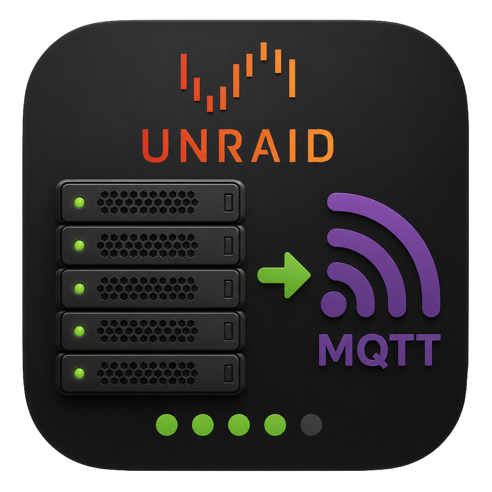
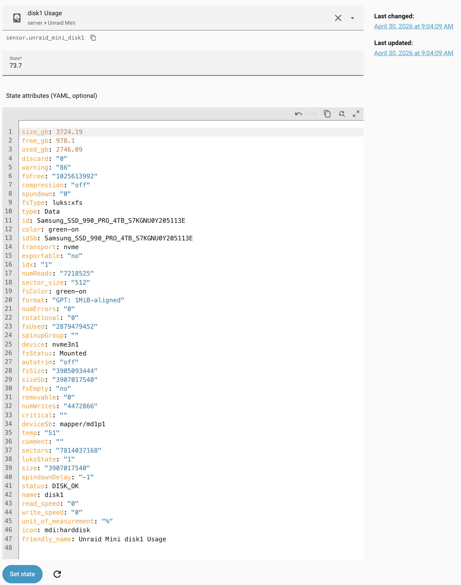
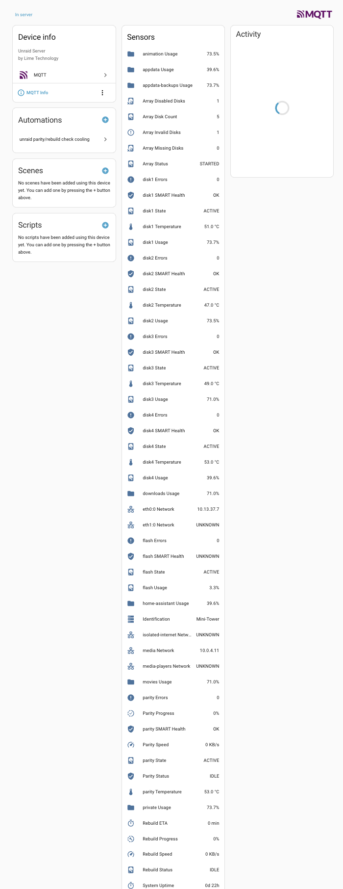

# unraid-stats2mqtt



An Unraid plugin (no Docker) that monitors your array and publishes metrics to an MQTT broker in **Home Assistant discovery format**.

## Features

| Metric | HA Entities Created | Possible Values |
|---|---|---|
| Array status | `sensor.unraid_array_status` | `STARTED`, `STARTING`, `STOPPED`, `STOPPING`, `DEGRADED` |
| Array disk count | `sensor.unraid_array_num_disks` | count |
| Array disabled disks | `sensor.unraid_array_disabled_disks` | count |
| Array invalid disks | `sensor.unraid_array_invalid_disks` | count |
| Array missing disks | `sensor.unraid_array_missing_disks` | count |
| Array capacity | `sensor.unraid_array_capacity` | GB |
| Array used | `sensor.unraid_array_used` | `0`–`100` (%) |
| Cache state | `sensor.unraid_cache_state` | `STARTED`, `STOPPED`, etc. |
| Cache devices | `sensor.unraid_cache_num_devices` | count |
| Cache capacity | `sensor.unraid_cache_capacity` | GB |
| Cache used | `sensor.unraid_cache_used` | `0`–`100` (%) |
| Parity check | `sensor.unraid_parity_status` | `IDLE`, `RUNNING`, `PAUSED` |
| Parity progress | `sensor.unraid_parity_progress` | `0`–`100` (%) |
| Parity speed | `sensor.unraid_parity_speed` | KB/s |
| Disk rebuild | `sensor.unraid_rebuild_status` | `RUNNING`, `PAUSED` |
| Disk rebuild progress | `sensor.unraid_rebuild_progress` | `0`–`100` (%) |
| Disk rebuild speed | `sensor.unraid_rebuild_speed` | KB/s |
| Disk rebuild ETA | `sensor.unraid_rebuild_eta` | minutes |
| Unraid version | `sensor.unraid_unraid_version` | version string |
| Server identification | `sensor.unraid_identification` | server name — see [attributes](#sensor-attributes) |
| Disk temperatures | `sensor.unraid_<disk>_temp` | °C |
| Disk states | `sensor.unraid_<disk>_state` | `ACTIVE`, `STANDBY`, `DISABLED` |
| Disk errors | `sensor.unraid_<disk>_errors` | count |
| Disk usage | `sensor.unraid_<disk>` | `0`–`100` (%) — see [attributes](#sensor-attributes) |
| SMART health | `sensor.unraid_<disk>_smart_health` | `PASSED`, `FAILED`, `UNKNOWN` — see [attributes](#sensor-attributes) |
| Reallocated sectors | `sensor.unraid_<disk>_reallocated` | count |
| Pending sectors | `sensor.unraid_<disk>_pending_sectors` | count |
| Offline uncorrectable | `sensor.unraid_<disk>_offline_uncorrectable` | count |
| Power-on hours | attribute of `sensor.unraid_<disk>_smart_health` | hours |
| Read speed | `sensor.unraid_<disk>_read_speed` | KB/s |
| Write speed | `sensor.unraid_<disk>_write_speed` | KB/s |
| Network RX | `sensor.unraid_net_<iface>_rx` | KB/s |
| Network TX | `sensor.unraid_net_<iface>_tx` | KB/s |
| Share usage | `sensor.unraid_share_<share>_info` | `0`–`100` (%) — see [attributes](#sensor-attributes) |
| System uptime | `sensor.unraid_system_uptime` | seconds |
| Array errors | `sensor.unraid_monitor_array_errors` | count |
| Parity history | `sensor.unraid_monitor_parity_history` | text |
| Flash drive state | `sensor.unraid_flash_state` | `OK`, etc. |
| Docker disk usage | `sensor.unraid_docker_disk_usage` | `0`–`100` (%) |
| Device usage | `sensor.unraid_monitor_<device>_used_pct` | `0`–`100` (%) |
| Device alert | `sensor.unraid_monitor_<device>_alert` | `0` / `1` |

### Sensor Attributes

Several sensors expose additional detail as HA state attributes (accessible via `{{ state_attr(...) }}` in templates):



| Sensor | Attributes |
|---|---|
| `sensor.unraid_<disk>` (disk usage) | `size_gb`, `free_gb`, `used_gb`, `read_speed`, `write_speed`, plus raw fields from `disks.ini` |
| `sensor.unraid_<disk>_smart_health` | `power_on_hours`, `crc_errors`, `nvme_unsafe_shutdowns` (NVMe), `nvme_media_errors` (NVMe) |
| `sensor.unraid_share_<share>_info` | All fields from `shares.ini` (e.g. `share`, `color`, `free`, `used`, `size`, `include`, `exclude`) |
| `sensor.unraid_identification` | `server_name`, `description`, `model`, `version` |

- Per-metric publish rules: **interval**, **on-change**, or **both**
- Protocol support: **MQTT**, **MQTTS** (TLS), **WS**, **WSS**
- TLS: CA cert, client cert/key, or insecure skip-verify
- Pure Bash/PHP daemon — no Docker, no Node, no Python required
- Settings UI in the Unraid WebUI under **Settings → MQTT Monitor**

---

## Installation

### From URL

1. In Unraid, go to **Plugins → Install Plugin**
2. Paste the raw URL to `https://raw.githubusercontent.com/maxandcheeses/unraid-stats2mqtt/refs/heads/main/plugin/unraid-stats2mqtt.plg`
3. Click Install

### Manual / Development

1. Copy the `source/` tree to your Unraid server:
   ```bash
   rsync -av source/ root@your-unraid:/
   ```
2. Make scripts executable:
   ```bash
   chmod +x /usr/local/emhttp/plugins/unraid-stats2mqtt/scripts/mqtt_monitor.sh
   chmod +x /etc/rc.d/rc.unraid-stats2mqtt
   ```
3. Start the daemon:
   ```bash
   /etc/rc.d/rc.unraid-stats2mqtt start
   ```
4. Visit **Settings → MQTT Monitor** in the WebUI.

---

## Configuration

All settings are managed via the WebUI. Config is persisted to:

```
/boot/config/plugins/unraid-stats2mqtt/config.cfg
```

Certificates are stored in:

```
/boot/config/plugins/unraid-stats2mqtt/certs/
```

### Key Settings

| Setting | Description | Default |
|---|---|---|
| `MQTT_HOST` | Broker IP or hostname | `localhost` |
| `MQTT_PORT` | Broker port | `1883` |
| `MQTT_PROTOCOL` | `mqtt` / `mqtts` / `ws` / `wss` | `mqtt` |
| `MQTT_BASE_TOPIC` | HA discovery prefix | `homeassistant` |
| `MQTT_DEVICE_ID` | Used in topic paths | `unraid` |
| `PUBLISH_ARRAY_STATUS` | `interval` / `onchange` / `both` | — |
| `INTERVAL_ARRAY_STATUS` | Seconds between array status publishes | `300` |
| `PUBLISH_ARRAY_SUMMARY` | `interval` / `onchange` / `both` | — |
| `INTERVAL_ARRAY_SUMMARY` | Seconds between array summary publishes | `300` |
| `PUBLISH_CACHE` | `interval` / `onchange` / `both` | — |
| `INTERVAL_CACHE` | Seconds between cache publishes | `300` |
| `PUBLISH_PARITY` | `interval` / `onchange` / `both` | — |
| `INTERVAL_PARITY` | Seconds between parity publishes | `300` |
| `PUBLISH_REBUILD` | `interval` / `onchange` / `both` | — |
| `INTERVAL_REBUILD` | Seconds between rebuild publishes | `300` |
| `PUBLISH_SYSTEM_INFO` | `interval` / `onchange` / `both` | — |
| `INTERVAL_SYSTEM_INFO` | Seconds between system info publishes | `300` |
| `PUBLISH_DISK_TEMPS` | `interval` / `onchange` / `both` | — |
| `INTERVAL_DISK_TEMPS` | Seconds between disk temp publishes | `300` |
| `PUBLISH_DISK_STATES` | `interval` / `onchange` / `both` | — |
| `INTERVAL_DISK_STATES` | Seconds between disk state publishes | `300` |
| `PUBLISH_DISK_USAGE` | `interval` / `onchange` / `both` | — |
| `INTERVAL_DISK_USAGE` | Seconds between disk usage publishes | `300` |
| `PUBLISH_DISK_ERRORS` | `interval` / `onchange` / `both` | — |
| `INTERVAL_DISK_ERRORS` | Seconds between disk error publishes | `300` |
| `PUBLISH_SMART` | `interval` / `onchange` / `both` | — |
| `INTERVAL_SMART` | Seconds between SMART publishes | `300` |
| `PUBLISH_RW_SPEEDS` | `interval` / `onchange` / `both` | — |
| `INTERVAL_RW_SPEEDS` | Seconds between R/W speed publishes | `300` |
| `PUBLISH_NETWORK` | `interval` / `onchange` / `both` | — |
| `INTERVAL_NETWORK` | Seconds between network speed publishes | `60` |
| `PUBLISH_UPTIME` | `interval` / `onchange` / `both` | — |
| `INTERVAL_UPTIME` | Seconds between uptime publishes | `60` |
| `PUBLISH_MONITOR` | `interval` / `onchange` / `both` | — |
| `INTERVAL_MONITOR` | Seconds between monitor.ini publishes | `300` |
| `PUBLISH_SHARES` | `interval` / `onchange` / `both` | — |
| `INTERVAL_SHARES` | Seconds between share usage publishes | `300` |

---

## MQTT Topic Structure

Discovery config topics (retained):
```
homeassistant/sensor/unraid_<entity>/config
```

State topics:
```
homeassistant/sensor/unraid_array_status/state
homeassistant/sensor/unraid_disk1_temp/state
homeassistant/sensor/unraid_disk1_read_speed/state
...
```

---

## Home Assistant

Once the plugin is running and your HA MQTT integration is configured, entities appear automatically via MQTT discovery. No manual YAML required.



Example Lovelace card:
```yaml
type: entities
title: Unraid Array
entities:
  - sensor.unraid_array_status
  - sensor.unraid_parity_status
  - sensor.unraid_parity_progress
  - sensor.unraid_parity_speed
  - sensor.unraid_rebuild_status
  - sensor.unraid_rebuild_progress
  - sensor.unraid_rebuild_speed
  - sensor.unraid_rebuild_eta
  - sensor.unraid_disk1_temp
  - sensor.unraid_disk1_state
  - sensor.unraid_disk1_smart_health
  - sensor.unraid_disk1_reallocated
  - sensor.unraid_disk1_pending_sectors
  - sensor.unraid_disk1_read_speed
  - sensor.unraid_disk1_write_speed
```

---

## TLS / Certificates

For **MQTTS** or **WSS**, upload your certs via the WebUI:
- **CA Certificate** — the broker's CA cert (`.crt` / `.pem`)
- **Client Certificate** — optional, for mutual TLS
- **Client Key** — private key for the client cert

Enable **Skip TLS Verify** for self-signed certs without a CA file (not recommended for production).

---

## Daemon Management

```bash
# Start / stop / restart
/etc/rc.d/rc.unraid-stats2mqtt start
/etc/rc.d/rc.unraid-stats2mqtt stop
/etc/rc.d/rc.unraid-stats2mqtt restart

# Status
/etc/rc.d/rc.unraid-stats2mqtt status

# Send a test message manually
/usr/local/emhttp/plugins/unraid-stats2mqtt/scripts/mqtt_monitor.sh test

# View logs
tail -f /var/log/unraid-stats2mqtt.log
```

---

## Building for Distribution

```bash
./build.sh
```

Outputs to `dist/`:
- `unraid-stats2mqtt-YYYY.MM.BUILD.txz` — source package
- `unraid-stats2mqtt.plg` — plugin definition

---

## Dependencies

- `mosquitto-clients` (provides `mosquitto_pub`) — auto-installed by the plugin
- `smartmontools` — available by default on Unraid
- `hdparm` — available by default on Unraid

---

## License

MIT
